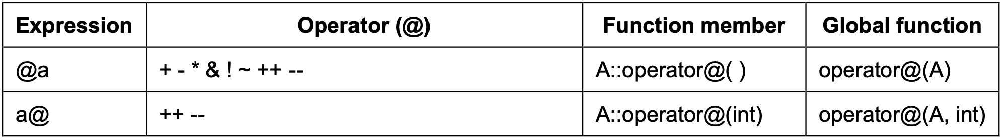
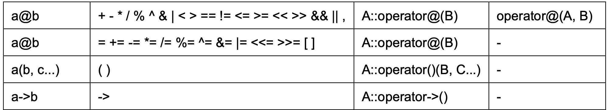

# 5. Overloading Operator

如果我們要在不同 class 間定義運算的話，就必須使用到  C++ overload 的能力，

舉例來說，我們可以直接利用 int 間使用 ```+``` 來做兩整數間的加法，但如果使用：

```
Point a, b, c;
c = a + b;
```
這樣的 class 加法時，我們就必須透過定義 overloading operator 來讓 compilier 知道 Point 間相加的運算要怎麼處理。

overloading operator 可以定義在 class 裡的 member function 中：

```
type operator sign (parameters);
```

舉例來說：

```
Point Point::operator+ (Point param) {
	Point temp;
	temp.x = x + param.x;
	temp.y = y + param.y;
	return temp;
}

Point Point::operator- (Point param) {
	Point temp;
	temp.x = x - param.x;
	temp.y = y - param.y;
	return temp;
}
```

就定義了在 Point 這個 class 間 ```+``` 和 ```-``` 的操作，我們可以直接用：

```
Point a, b, c;
c = a + b;
```

或是：
```
c = a.operator+ b;
```

而通常，assignation operator 會被自動定義，如果沒有特別指定：
```
c = a;
```
代表的是將等號右邊的物件中的 non-static member 複製到等號左邊的物件。

而常見可以 overload 的 operator 如下圖所示：




下面是一個 prefix 和 postfix increment operator 的實作範例：

```
Point& Point::operator++(void) {
	*x = *x + 1;
	*y = *y + 1;
	return *this;
}

Point Point::operator++(int) {
	Point temp = *this;
	++*this;
	return temp;
}
```

可以看到的是，這裡先定義了 prefix increment operator，再利用 prefix 去定義 postfix。

可以注意到的是，我們可以定義 overloading operator 為 member function 或是 global function，但要特別注意的是 global function 如果不是該 class 的 friend function，就不能存取到該 class 的 private 或 protected member。